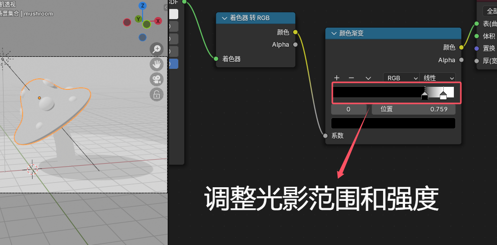

三渲二使用ev渲染器，因为它有一个着色器转RGB的节点，可以做出来比较平面化的投影
# 一、模型打光

# 二、上色（着色器编辑器）
## 1、新建着色器转RBG

## 2、新建颜色渐变——调阴影

这样就可以只用调整蘑菇头的颜色渐变，其他部件的颜色渐变也会跟着变
## 3、新建颜色渐变——做固有色

但发现了一个问题，蘑菇不可能全身是红的，所以就要取消关联，单独上材质

## 4、新建混合颜色

## 5、新建色相饱和度

## 6、调色注意

# 三、加线条
## 1、描边
新建场景线条画

比如可以修改线条的颜色

## 2、画线

### 小知识：中括号可以微调笔刷的大小

# 四、部分设置及最后渲染

可以调低分辨率渲染测试一下，如果发现后面的一些线条跑到了前面（如下图所示）

那么就要打开视图层，勾选Z通道（如下图所示）

这是传递一个距离信息，之后再渲染就不会出现这种问题了
