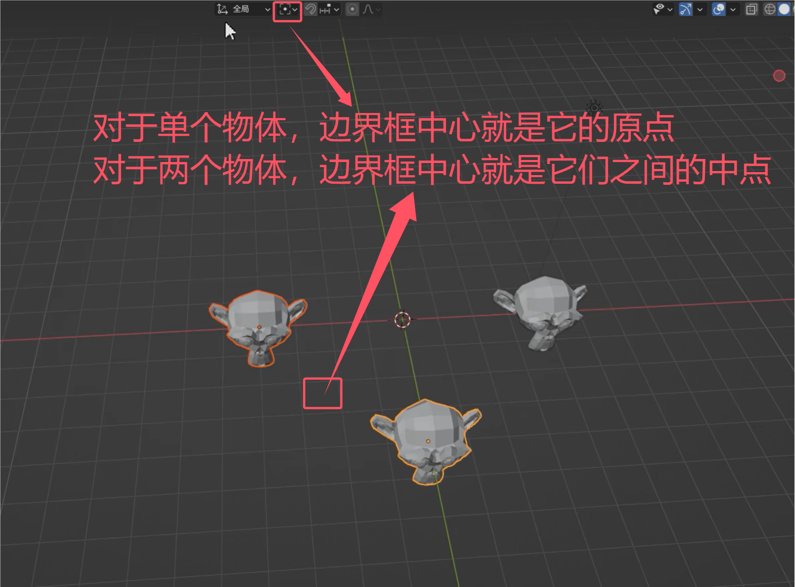
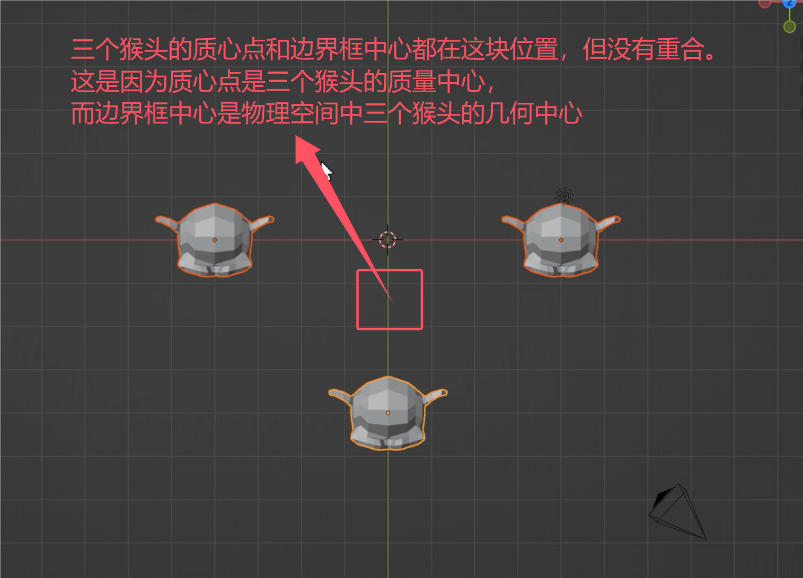

# 一、基础切换视图操作
​​

# 二、熟悉界面操作
## 1、最基本的3d工作流程

## 2、如果布局不小心弄乱了怎么复原

## 3、如何最大化界面

## 4、游标的导航定位作用

## 5、如何绕着游标旋转

## 6、怎么移动物体原点

记得移动完原点后要把这个选项关掉先！
之后可以alt+g让方块回到世界中心

## 7、计算不懂建模，它只认原点

## 8、如何跟随鼠标位置缩放视图

## 9、如何围绕物体旋转观察

## 10、如何吸附网格移动

## 11、变换轴心点

## 12、全局坐标和局部坐标

## 13、快速切换全局坐标和局部坐标

