# 一、创建圆环并对好位置
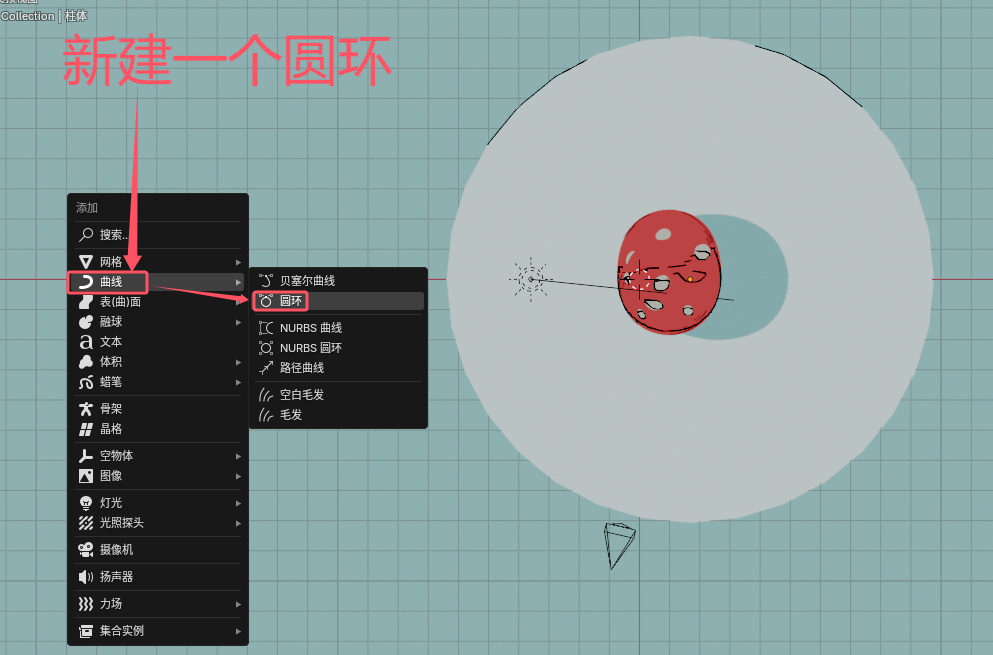
注意是选择曲线里的圆环！（如果选到网格里的圆环是不能作为跟随路径的参考对象的）
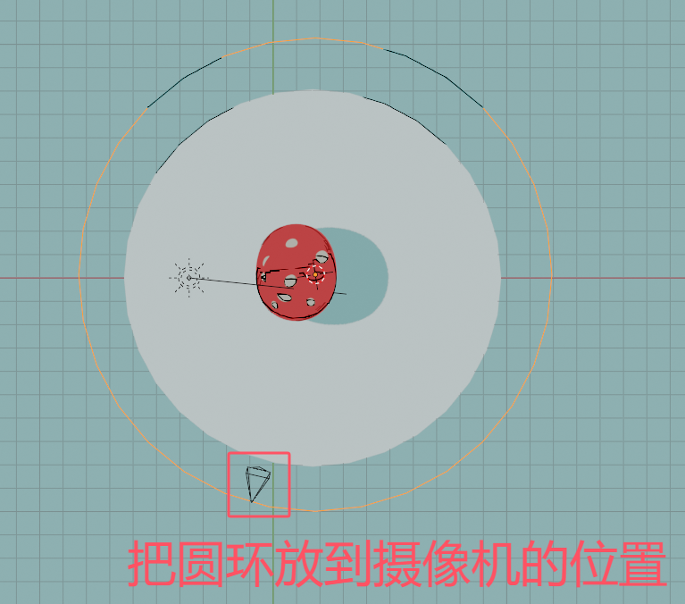
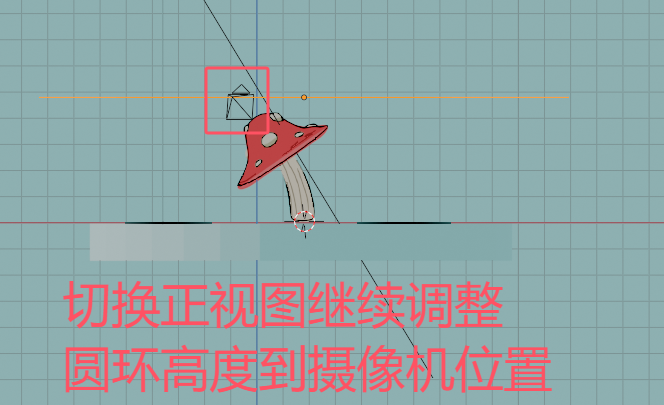
# 二、路径跟随
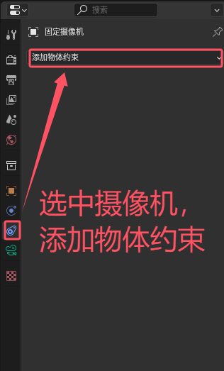
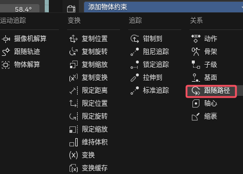
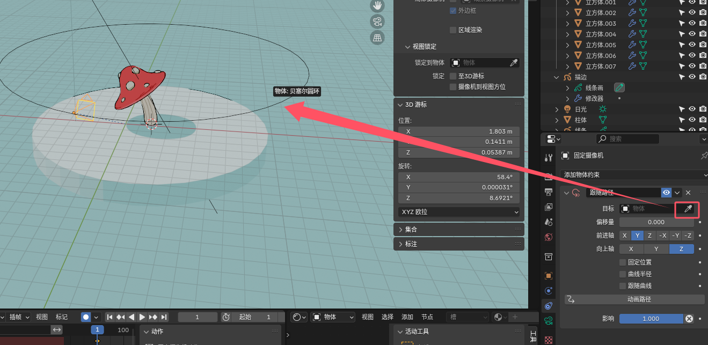
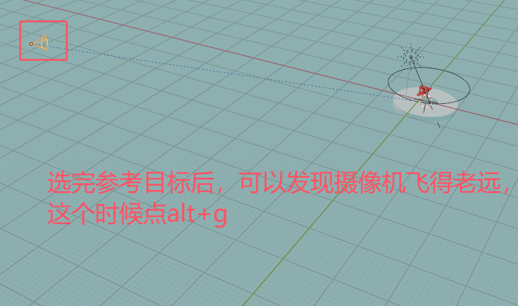
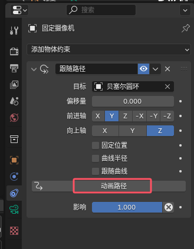
# 三、标准追踪
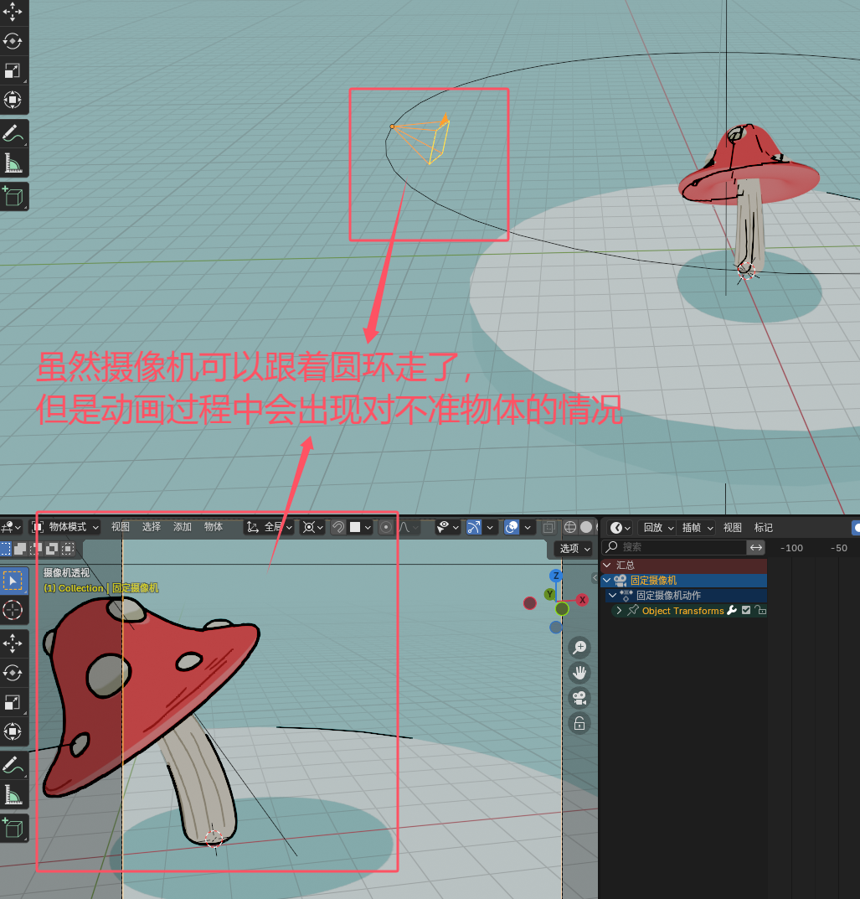
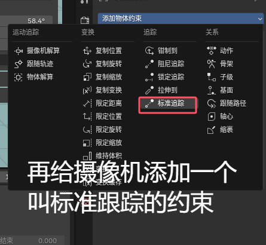
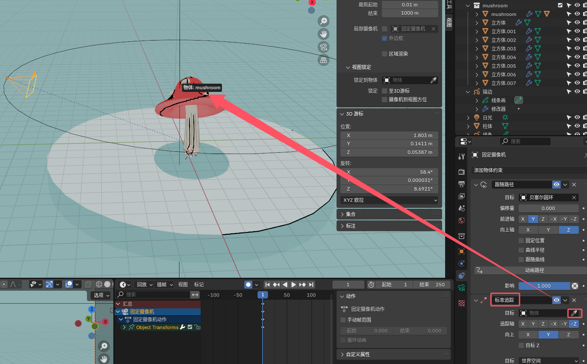
# 四、一些小技巧
## 1、修改路径

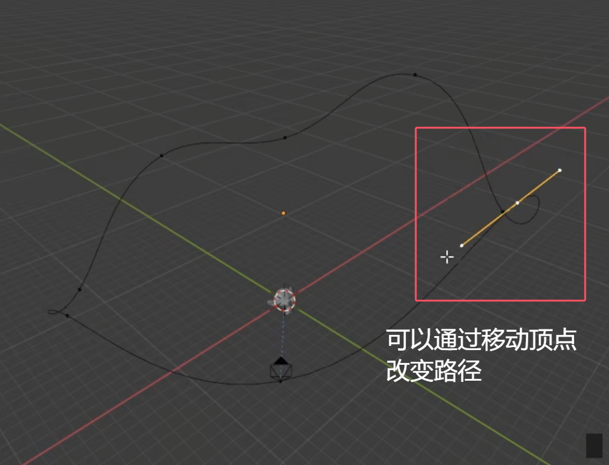
还可以随时修改圆环的位置和大小
## 2、还原圆环路径
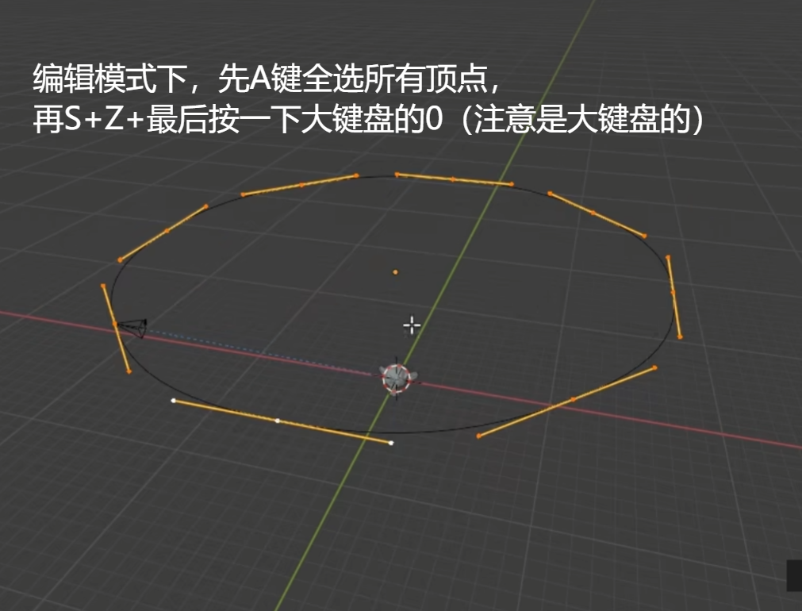
## 3、改变旋转速度
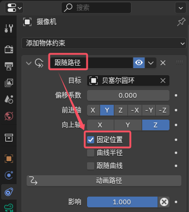
这个固定位置很关键！
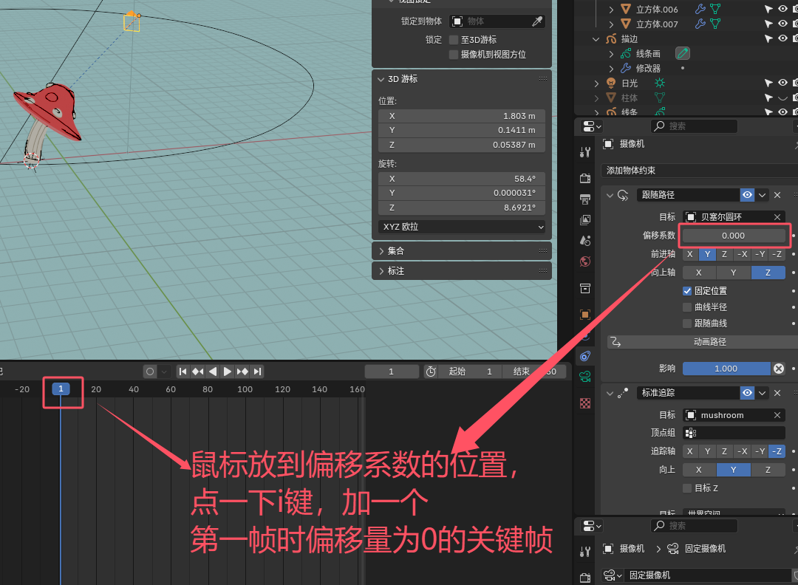
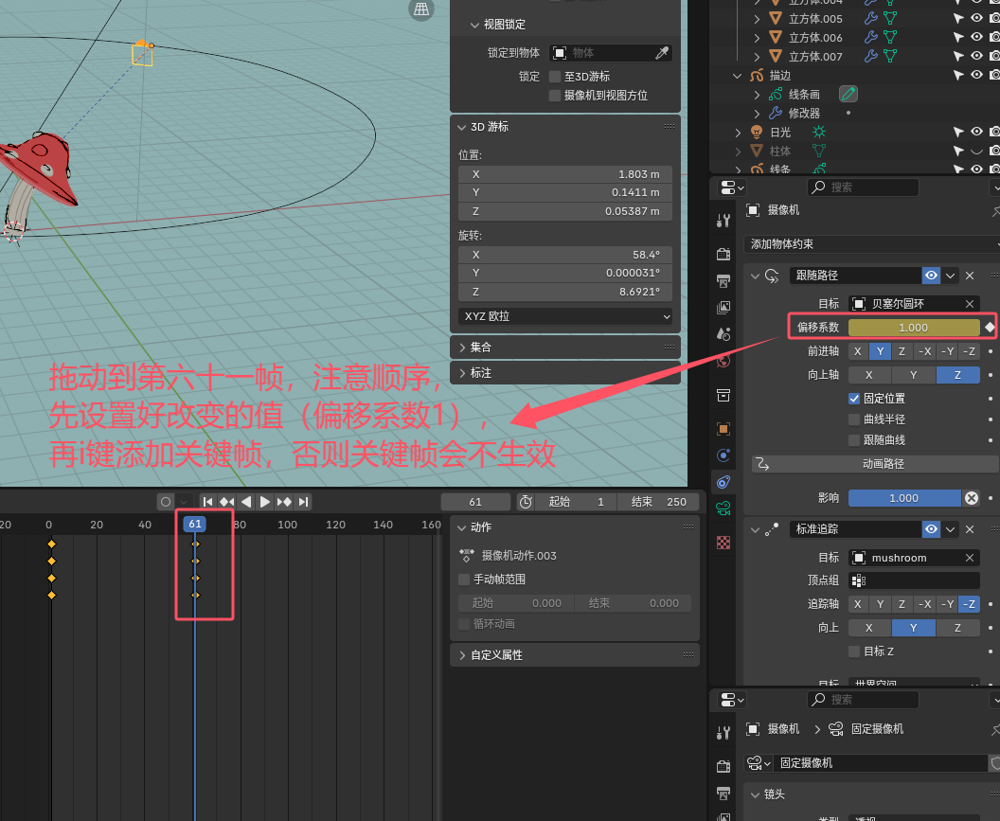
偏移系数就是圈数的意思，设置完后，摄像机将会以60帧为周期转一圈
## 4、改变插值方式
可能旋转过程中会出现缓入缓出的问题，
如果想要改成线性，方法如下图
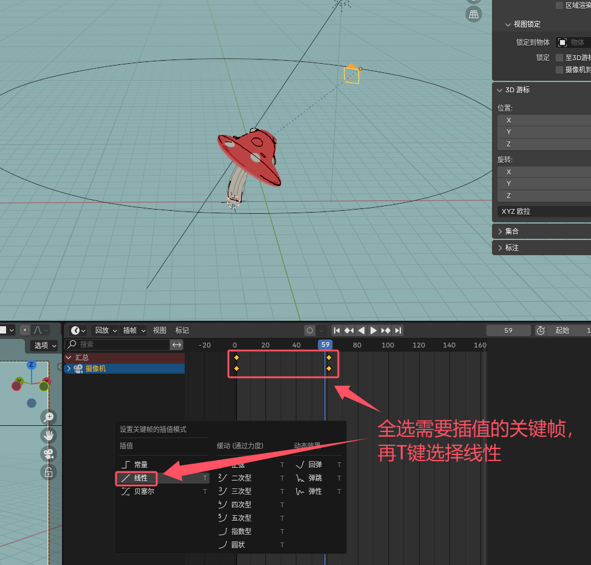
注意鼠标要拖到时间轴再按T键才有效果